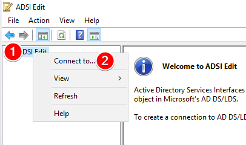
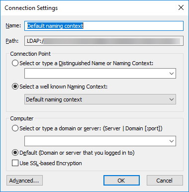

# Microsoft LAPS (Local Administrator Password Solution)

## Install/prep

### Add your DA account to Schema Admins:

1. From the workstation where you will manage LAPS, log off as your DA account and back in (to get the Schema Admins token to take effect). 
 
2. Download the LAPS bundle at [https://www.microsoft.com/en-us/download/details.aspx?id=46899](https://www.microsoft.com/en-us/download/details.aspx?id=46899). 
 
3. Run the LAPS.x64.msi and in the install, choose to install the **AdmPwd GPO Extension** (selected by default) but also the **Management Tools** by clicking the drop-down and selecting **Entire feature will be installed on local hard drive**.  (After completing these steps you should now see Local Administrator Password Solution in the installed programs list)
 
### Configure policy store for LAPS

1. Copy *C:\Windows\PolicyDefinitions\AdmPwd.admx* and *C:\Windows\PolicyDefinitions\en-us
\AdmPwd.adml* to * \\domain\sysvol\yourdomain.com\Policies\PolicyDefinitions\*.  Note, if your central store is not setup, you will want to follow [this article](https://support.microsoft.com/en-us/help/929841/how-to-create-the-central-store-for-group-policy-administrative-template-files-in-windows-vista) to get it configured first.
 
### Configure AD for LAPS

First, ensure you are running at least Powershell 3.x on your administrative workstation (run **$PSVersionTable.PSVersion** to determine that, then install [WMF 5.0](https://msdn.microsoft.com/en-us/powershell/wmf/5.0/requirements) to quickly jump from older versions of PS to the current). 
 
On your admin workstation, issue these PowerShell commands:
 
`Import-module AdmPwd.PS`

`Update-AdmPwdADSchema`
 
 Next you need to grant computers the ability to update their password attribute.  We'll designate this by OU.  In my example I have all computers in an OU called *PWN-COMPUTERS* so I'll issue:
 
`Set-AdmPwdComputerSelfPermission -Identity PWN-COMPUTERS`
 
Note: repeat this for any other OUs this applies to, like PWN-SERVERS, etc.

Next, on a server

- Open **ADSIEdit**
- Right click on *ADSI Edit* or click *Action*, then click *Connect to...*

- You can probably click *OK* without changing settings unless you need to change to a sub-domain

- Click *Default naming context*, so it shows the expansion icon *>*

- Expand *Default naming context*

- Check who currently has permissions run the following powershell command

`Find-AdmPwdExtendedRights -Identity "PWN-COMPUTERS"`

- Right-click on the OU that has computer accounts you're installing LAPS on, such as the *PWN-COMPUTERS* OU and 
- Click *Properties*
- Click *Security*
- Click *Advanced*
, then click groups/users you don't want to be able to read passwords and click **Edit**.  Then uncheck **All Extended Rights**. 
 
To double-check what permissions you've set on a given OU, issue this PowerShell command:
 
`Find-AdmPwdExtendedRights -Identity "PWN-COMPUTERS"`
 
Note: if this command doesn't work, issue the **Import-module AdmPwd.PS** command again.
 
Next, add rights to users to allow them to retrieve a computer's password:
 
`Set-AdmPwdReadPasswordPermission -OrgUnit "PWN-COMPUTERS" -AllowedPrincipals "Domain Admins"`

Note: Domain Admins always have rights to view passwords, even if you remove them.

### Create GPO to deploy LAPS package
 
Open **Group Policy Management** and create a new GPO in *Group Policy Objects* but don't link it to anything yet.  Call it something smart like *Deploy LAPS*.  Configure it like so:
 
* *Comp Config > Policies > Software Settings > Software installation* and add **LAPS.x64** as *Assigned*.
 
* *Comp Config > Policies > Software Settings > Software installation* and add **LAPS.x32** as *Assigned*.
 
 * Look at the properties for the *LAPS.x32* and under *Deployment > Advanced* uncheck the box for *Make this 32-bit X86 app available to Win64 machines*.

Note: if you want to be certain that you don't accidentally push this to servers, create a WMI filter for this GPO by opening **Group Policy Management**, creating a **New WMI Filter** with `root\CIMv2` as the namespace and `Select * from WIN32_OperatingSystem where ProductType="1"` as the query.  *Warning*: this may generate an error about "Either the namespace entered is not a valid namespace..." but according to [this article](https://social.technet.microsoft.com/Forums/windowsserver/en-US/e554a894-6481-4f94-aa06-5b1a1b76c97f/gpo-wmi-filters-are-failing?forum=winserverGP) it's just a bug.  
   
### Create GPO to enforce LAPS config
Next, create a GPO that's not linked to anything (reminder, you'll want to eventually apply this to servers and workstations but NOT domain controllers!).  The settings you need to config are:
 
* *Computer Configuration > Policies > Administrative Templates > LAPS > Enable local admin password management > Enabled*.  This will, every 30 days, randomize the local admin with crazy 14-character password!
 
* *Computer Configuration > Policies > Administrative Templates > LAPS > Password Settings* can be tuned to however aggressive you want.
 
* *Computer Configuration > Policies > Administrative Templates > LAPS > Name of administrator account to manage* can be set to a global/universal admin account. 
 
* *Computer Configuration > Policies > Administrative Templates > LAPS > Do not allow password expiration time longer than required by policy*.  If this is checked, the local admin pw has to be refreshed in accordance with domain-level policy.

Note: if you want to be certain that you don't accidentally push this to servers, create a WMI filter for this GPO by opening **Group Policy Management**, creating a **New WMI Filter** with `root\CIMv2` as the namespace and `Select * from WIN32_OperatingSystem where ProductType="1"` as the query.  *Warning*: this may generate an error about "Either the namespace entered is not a valid namespace..." but according to [this article](https://social.technet.microsoft.com/Forums/windowsserver/en-US/e554a894-6481-4f94-aa06-5b1a1b76c97f/gpo-wmi-filters-are-failing?forum=winserverGP) it's just a bug.  

## Troubleshooting

### It seems like some machines just won't install the .msi via Group Policy - wassupwitdat?
I've found that Windows 8 machines seem to be real stubborn when it comes to receiving this .msi gracefully.  I'm still researching workarounds, but for some of them I've just run (as local admin) this command on the offending machines:

`msiexec /i <file location>LAPS.x##.msi /quiet` (where `##` is `86` or `64`)

*Source:* [https://prajwaldesai.com/how-to-install-and-deploy-microsoft-laps-software/](https://prajwaldesai.com/how-to-install-and-deploy-microsoft-laps-software/)

This is a great troubleshooting site as well: [https://blog.thesysadmins.co.uk/deploying-microsoft-laps-part-1.html](https://blog.thesysadmins.co.uk/deploying-microsoft-laps-part-1.html).
